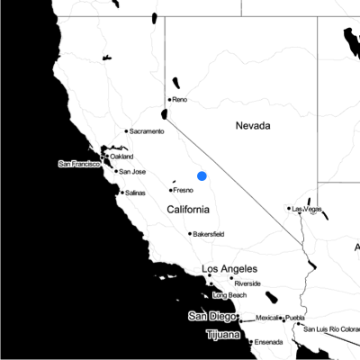

# ggmap Example
Two simple examples showing how to make quick-and-easy study area maps using ggmap. The trickiest thing is to get the ``zoom`` argument in ``get_map()`` correct -- sometimes it takes a couple tries to get it right. More on ``ggmap`` can be found here: http://cran.r-project.org/web/packages/ggmap/ggmap.pdf. 

---

```{r maps, warning = FALSE}
# Clear the workspace
rm(list=ls()) 

# Load libraries; you may need to install these as well like above
library(ggplot2)
library(ggthemes)
library(ggmap)

#~~~~~~~~~~~~~~~~~~~~~~~~~~~~~~~~~~~~~~~~~~~~~~~~~~~~~~~~~~~~~~~~~~~~~~~~~~~~~~~#
#                        MAP OF CA WITH KINGS CANYON NP                         #
#~~~~~~~~~~~~~~~~~~~~~~~~~~~~~~~~~~~~~~~~~~~~~~~~~~~~~~~~~~~~~~~~~~~~~~~~~~~~~~~#
# First use 'geocode' to get the lat/long of USU -- this is essentially a Google search
confPt <- geocode("kings canyon national park")
# Now get the base map using 'get_map', the location is also a Google search
mapCA <- get_map(location="california", source ="stamen", maptype="toner", zoom=6)
# Put it together using 'ggmap' and the standard ggplot call to geom_point
ggmap(mapCA, extent="device")+
  geom_point(data=confPt, aes(x=lon, y=lat), color="dodgerblue", size=5)
```


```{r maps2, warning = FALSE}
# More examples
#~~~~~~~~~~~~~~~~~~~~~~~~~~~~~~~~~~~~~~~~~~~~~~~~~~~~~~~~~~~~~~~~~~~~~~~~~~~~~~~#
#                   MAP OF LOGAN WITH BEAVER MTN SKI RESORT                     #
#~~~~~~~~~~~~~~~~~~~~~~~~~~~~~~~~~~~~~~~~~~~~~~~~~~~~~~~~~~~~~~~~~~~~~~~~~~~~~~~#
# You can set the point coordinates mannually (or read in from spreadsheet), like below
beaverPt <- data.frame(lat=41.9683,
                       lon=-111.5417)
# Or you can get lat/longs from Google, like below
# beaverPt <- geocode("beaver mountain, utah")
map <- get_map(location = "Logan, UT", zoom = 8, source = "stamen", maptype="toner")
ggmap(map, extent="device")+
  geom_point(data=beaverPt, aes(x=lon, y=lat), color="dodgerblue", size=5)


```

---
